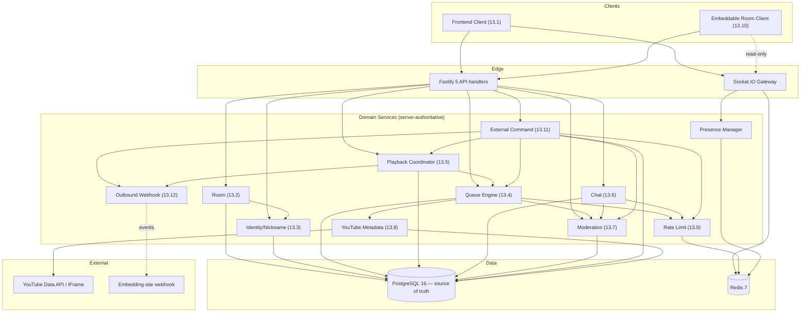
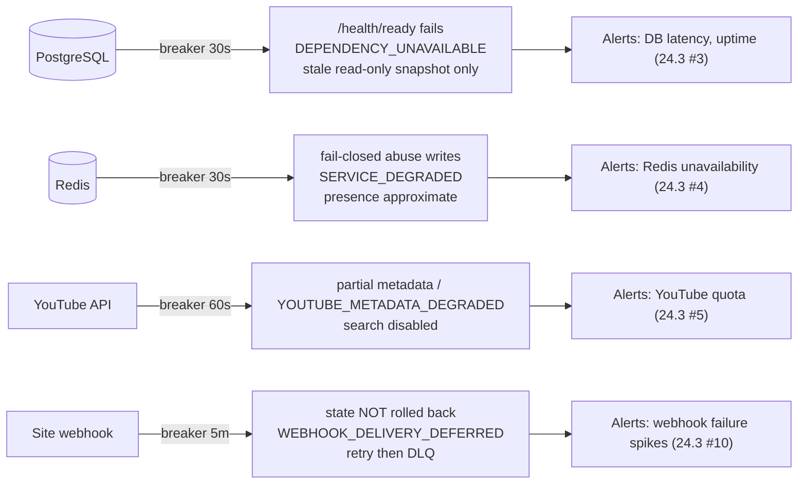
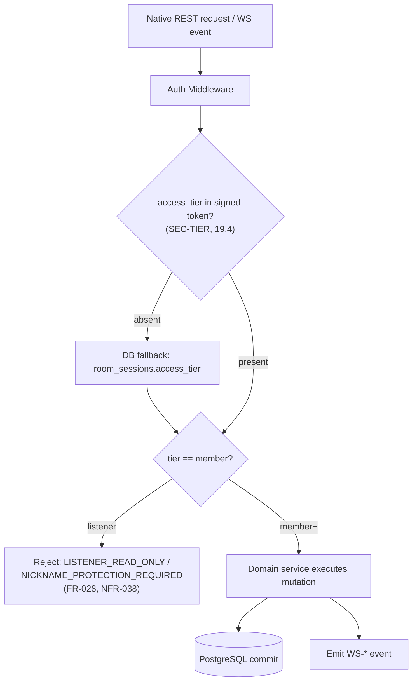

# trackstacc-architecture-dependencies.md

> **Engineering Knowledge-Graph Layer — Deliverable 4 of 7**
> Component and infrastructure dependency model. For each node: what it depends on, what depends on it, its failure impact, fallback behavior, and monitoring signals.
> Spine: SDD §12.5.3 (dependency directions), §13 (12 components), §23.6 (circuit breakers + degradation rules), §24 (observability). Component IDs follow `COMP` (§13) and `ARCH` (§12) from `trackstacc-ai-documentation-plan.md` §2.
> **Server-authoritative invariant (§12):** all room mutations, playback decisions, moderation, rate limits, and audit are decided server-side. PostgreSQL is the source of truth; Redis/cache must never become authoritative (§23.6.2 #3).

---

## 1. Layer overview (`ARCH` §12)

| Layer | Nodes | Backing infra |
| --- | --- | --- |
| Frontend | Frontend Client (§13.1), Embeddable Room Client (§13.10) | CDN / static |
| API (Fastify 5 + TS) | thin handlers → domain services | — |
| Realtime (Socket.IO) | Socket.IO gateway, Presence Manager | Redis pub/sub + adapter |
| Domain services | Room, Identity, Queue Engine, Playback Coordinator, Chat, Moderation, Rate Limit, External Command, Outbound Webhook, YouTube Metadata | PostgreSQL + Redis |
| Data | (all services via Prisma / ioredis) | PostgreSQL 16, Redis 7 |
| External | YouTube Data API / IFrame, embedding-site webhooks | third-party |

**Core service dependency directions (§12.5.3):** Room → Identity; Queue Engine → Rate Limit, → Moderation; Playback Coordinator → Queue Engine; Chat → Rate Limit, → Moderation; External Command → Queue Engine / Playback / Moderation / Rate Limit; Outbound Webhook ← External Command / Playback. **Services never depend on Fastify `req`/`reply`** (testability invariant).

---

## 2. Component dependency table

| Component | Depends On | Used By | Failure Impact | Fallback Behavior | Monitoring Signals |
| --- | --- | --- | --- | --- | --- |
| **Frontend Client** (§13.1) | API layer, Socket.IO gateway | end users | Native UI unusable | Static shell from CDN; retry API/WS with backoff | LCP (NFR-004); WS disconnect spikes (§24.3 #2) |
| **Embeddable Room Client** (§13.10) | embed endpoints, read-only WS, `SEC-CSP` per-integration | embedding sites | Embed blank/stale | Display last snapshot; show outage notice; never mutate | Rejected-origin logs (§19.6.2); integration abuse triggers (§24.1 #19) |
| **Socket.IO Gateway** (Realtime) | Redis (pub/sub + adapter), session tokens | Frontend/Embed clients | Realtime broadcast fails cross-instance | Single-instance fallback unsafe for scale (§23.6.2 #2); clients reconnect with backoff (§16.1.1) | WS connections (§24.1 #3); disconnect spikes (§24.3 #2) |
| **Presence Manager** (Realtime) | Redis, `room_sessions` | Frontend Client, Queue Engine (DJ rotation) | Presence inaccurate | Query PostgreSQL lastSeenAt / leftAt fallback semantics; Redis is not authoritative; failure is approximate presence, not unbounded participant duplication | Active participants (§24.1 #2) |
| **Room Service** (§13.2) | PostgreSQL, Identity Service | API handlers, Queue Engine, External Command | Room CRUD/settings fail | PG breaker → `DEPENDENCY_UNAVAILABLE`; readiness fails (§23.6 PG) | Active rooms (§24.1 #1), room creation rate (#9) |
| **Identity / Nickname Service** (§13.3) | PostgreSQL, Rate Limit Service, Argon2id | Room Service, Auth Middleware, every gated path | **Auth + tier gate down → no participation** | Reject member actions safely; listeners may still read; PG breaker fail | Nickname protection rate (#10), failed password attempts (#11) |
| **Queue Engine** (§13.4) | Rate Limit Service, Moderation Service, YouTube Metadata Service, PostgreSQL | Playback Coordinator, External Command, API handlers | No add/select/veto resolution | YouTube breaker → accept by video ID w/ `metadata_status=partial` where policy allows (§23.6.2 #1) | Queue additions/min (#5), veto windows (#16) |
| **Playback Coordinator** (§13.5) | Queue Engine, PostgreSQL, server clock | Frontend/Embed clients (via WS) | Sync/advance stalls | Server authority + periodic resync (≤3s, NFR-003); mark failed track + skip (FR-046) | Playback error rate (#8), WS disconnects (#2) |
| **Chat Service** (§13.6) | Rate Limit Service, Moderation Service, PostgreSQL | Frontend Client, system messages | Chat send/history fail | PG breaker → reject writes; reads may serve cached history | Messages/sec (#4), rate-limit triggers (#13) |
| **Moderation Service** (§13.7) | PostgreSQL | Queue Engine, Chat, Playback, External Command | Mod actions fail/unaudited | Fail closed for privileged writes; audit required (NFR-067) | Moderation actions (#12) |
| **Rate Limit Service** (§13.9) | Redis | Queue Engine, Chat, Identity, External Command | Abuse controls offline | **Fail closed** for abuse-sensitive writes when Redis down (§23.6.2 #2) | Rate-limit triggers (#13), integration abuse triggers (#19) |
| **External Command Service** (§13.11) | Queue Engine, Playback, Moderation, Rate Limit, PostgreSQL, Redis (idempotency) | embedding sites (via S2S), Outbound Webhook | External commands fail | `SEC-EXTINTEG` validation; idempotent retry; reject on Redis-down (§23.6.2 #2) | External command volume (#14), rejection rate (#15) |
| **Outbound Bot Webhook Service** (§13.12) | External Command / Playback (events), egress to webhook URL | embedding-site chat | Announcements undelivered | **Non-transactional:** never roll back room state; bounded retries + backoff → DLQ; `WEBHOOK_DELIVERY_DEFERRED` (§23.6 webhook, DL-017) | Webhook failures/retries (#18) |
| **YouTube Metadata Service** (§13.8) | YouTube Data API, PostgreSQL (`tracks` cache) | Queue Engine | Metadata/search fail | Cache-first; breaker → partial metadata or `YOUTUBE_METADATA_DEGRADED`; disable search (§23.6.2 #1) | YouTube quota usage (#6), metadata failure rate (#7) |

---

## 3. Infrastructure dependency table

| Infra | Depended on by | Failure Impact | Fallback Behavior (§23.6) | Breaker trigger / open duration | User-visible |
| --- | --- | --- | --- | --- | --- |
| **PostgreSQL 16** (source of truth) | all domain services via Prisma | Durable reads/writes stop | Readiness (`/health/ready`) fails; optionally serve stale, secret-free read-only snapshot; **never** let cache become authoritative | 3 failed health probes or pool exhaustion 30s; open 30s + half-open | `DEPENDENCY_UNAVAILABLE` on most actions |
| **Redis 7** | Rate Limit, Presence, Socket.IO adapter, idempotency | Rate limits + realtime coordination degrade | **Fail closed** for abuse-sensitive writes (external SR/votes, staff cmds, password attempts, room-creation bursts, public-room queue writes); safe PG reads allowed; fall back to PostgreSQL lastSeenAt index for presence query and cleanup | 3 consecutive conn failures or p95 >1s for 60s; open 30s + half-open | `SERVICE_DEGRADED`; "realtime degraded" |
| **YouTube Data API / IFrame** | YouTube Metadata Service, player | Metadata/search/playback failures | Queue by validated video ID w/ partial metadata where policy allows; defer enrichment to worker; disable in-app search; mark unplayable + skip | 5 failures or >50% timeout over 60s; open 60s + half-open | partial details; search outage |
| **Embedding-site webhook** | Outbound Bot Webhook Service | Announcements not delivered | Do **not** roll back accepted changes; bounded retries + idempotent delivery IDs → DLQ | 5 consecutive failures / repeated 429-5xx / >50% timeout over 5 min per integration; open 5 min + half-open | command succeeds w/ `WEBHOOK_DELIVERY_DEFERRED` |

**Circuit-breaker state machine (§23.6.1):** Closed → Open (fail-fast/fallback) → Half-open (probe) → Closed/Open. Transitions emit structured logs + metrics tagged by dependency/operation/room/integration/environment. Manual maintenance override is auditable. `/health` may stay alive in degraded mode; `/health/ready` fails when PG (or Redis where realtime/rate-limit correctness is required) is unavailable (§23.6.2 #5).

---

## 4. Mermaid — container / layer dependencies

## 5. Mermaid — failure propagation & breakers

## 6. Mermaid — the critical-path gate (`SEC-TIER`)

---

## 7. Dependency-risk hotspots (for review prioritization)

1. **Identity Service + `SEC-TIER`** — single chokepoint for all native participation. Any change here cascades to every gated component; see `trackstacc-change-impact-matrix.md` → Nickname Protection.
2. **Redis** — backs both rate limiting and realtime coordination; its degradation rule (fail-closed) is security-relevant, not just availability-relevant (§23.6.2 #2).
3. **External Command Service** — fans out to four other services and the webhook egress; all of it under the authoritative `SEC-EXTINTEG` (§19.5).
4. **Playback Coordinator ↔ Queue Engine ↔ Veto** — the advance cycle is timing-sensitive (3s sync, DL-010) and interacts with the veto window state machine (§17.6, DL-014).
